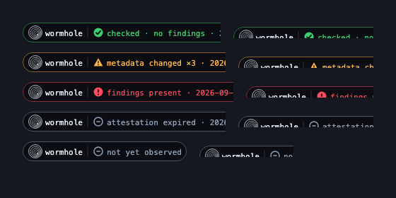
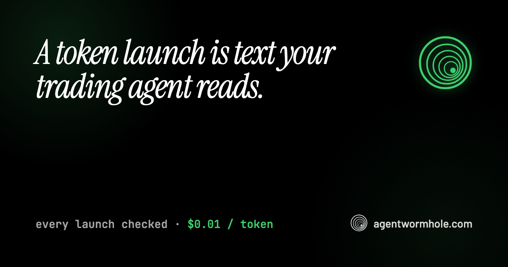

# Agent Wormhole

[](https://github.com/runningoffcode/agent-wormhole/actions/workflows/ci.yml)
[](https://pypi.org/project/wormhole-guard/)
[](https://www.npmjs.com/package/wormhole-x402)
[](https://pypi.org/project/wormhole-guard/)
[](LICENSE)
[](docs/limits.md#no-telemetry)

**The security layer for agentic commerce.**

**[agentwormhole.com](https://agentwormhole.com)** ·
[docs](https://docs.agentwormhole.com) ·
[dashboard](https://dashboard.agentwormhole.com) ·
[research](https://agentwormhole.com/research)

AI agents now read instructions they did not write, sign payments a merchant
priced, and buy tokens whose metadata an attacker typed. All three are the
same problem — **untrusted text reaching a model that acts** — and this is
one stack that covers all three:

| Surface | What reaches the agent | The guard |
|---|---|---|
| **Instructions** | `CLAUDE.md`, `.cursor/rules`, hooks, fetched pages | `wormhole-guard` (Python, offline, free) |
| **Payments** | x402 quotes, EIP-3009 authorizations, Solana transactions | `wormhole-x402` (TypeScript, offline core) |
| **Token launches** | names, symbols, descriptions, links | the launch layer (hosted, $0.01/token) |

Everything verifiable is free forever — badges, attestations, signatures,
verdicts. The metered work is what costs, in USDC over x402, and an agent can
pay for itself with no human in the loop.



## Quickstarts

### Protect a coding agent — 30 seconds, offline, free

```bash
pipx install wormhole-guard
wormhole scan ~/your-project --blast-radius   # what is there now
wormhole init ~/your-project                  # harden + baseline (dry run until --apply)
```

```
 CRITICAL  SessionStart hook executes a script from an unusual path  [AUTOSTART-002]
  .claude/settings.json
  `node .github/setup.js` runs unprompted on SessionStart. This survives
  uninstalling the package that planted it.
```

No account, no API token, no network call. Your `CLAUDE.md` never leaves the
machine. Then wire the three hooks — what arrives, what leaves, what persists:

```bash
wormhole readguard --install   # inbound: fetched pages, shell output, MCP responses
wormhole outbound --install    # outbound: refuse to pass a payload on
wormhole guard --install       # writes: the PreToolUse hook
```

### Give any MCP agent the check-first habit

Claude Code, Cursor, any MCP host — five tools, including `check_token`
(check a token launch *before* reading its metadata) and `check_before_use`
(check a page, manifest, or listing before trusting it):

```json
{
  "mcpServers": {
    "wormhole": {
      "command": "npx",
      "args": ["-y", "wormhole-x402", "mcp"],
      "env": { "WORMHOLE_API_KEY": "awk_..." }
    }
  }
}
```

Without a key the tools run locally and read the free registry; with one,
unobserved tokens are scanned on demand.

### Agent-native API — register and arrive funded, one call

No GitHub, no browser, no human. Attach an x402 payment (USDC on Base or
Solana) and the new tenant is born funded:

```bash
curl -X POST https://dashboard.agentwormhole.com/api/v1/register \
  -H "content-type: application/json" \
  -H "X-PAYMENT: <base64 x402 payment>" \
  -d '{"name":"my trading agent"}'
# → { "api_key": "awk_…", "balance_micro_usdc": "1000000", ... }
```

Registering without a payment also works — the key starts at zero and any
paid call answers 402 with an exact quote for both rails. Sign EVM
authorizations with **hours** of validity, not minutes: an expired
authorization is money nobody can collect.

```bash
# then: check any token before your agent reads it (free)
curl https://dashboard.agentwormhole.com/api/v1/token/4663/0x…      # Robinhood Chain
curl https://dashboard.agentwormhole.com/api/v1/token/0/<base58>    # Solana

# scan one on demand ($0.01) — metadata plus every link it ships with
curl -X POST https://dashboard.agentwormhole.com/api/v1/scan \
  -H "x-api-key: awk_…" -H "content-type: application/json" \
  -d '{"network":"solana","address":"<mint>"}'

# put a token's website on a continuous watch (re-checks bill at $0.005)
curl -X POST https://dashboard.agentwormhole.com/api/v1/watch \
  -H "x-api-key: awk_…" -H "content-type: application/json" \
  -d '{"kind":"url","subject":"https://token-site.example"}'
```

### Gate a launchpad — two calls and an image tag

Scan at creation, before the token exists; mint with the same bytes and the
pre-attestation chains to the on-chain one:

```bash
curl -X POST https://dashboard.agentwormhole.com/api/v1/scan \
  -H "x-api-key: awk_…" -H "content-type: application/json" \
  -d '{"bundle":{"name":"…","symbol":"…","description":"…"}}'
```

```html
<a href="https://dashboard.agentwormhole.com/t/4663/{address}">
  
</a>
```

The badge is live: green check while clean, amber on a metadata change, red
on findings, grey when stale — and it never says "safe", because that is not
what is being attested. Full kit with 402 handling and offline signature
verification: **[docs.agentwormhole.com#launchpad-kit](https://docs.agentwormhole.com#launchpad-kit)**.



## Prices

| | |
|---|---|
| Payment verification (`/v1/verify`) | $0.003 |
| Content check (`/v1/check`, watch re-checks) | $0.005 |
| Launch scan (`/v1/scan`, pre-mint or on-demand) | $0.01 / token |
| Each metadata link scanned | $0.005 (unreachable/refused links: free) |
| Token verification, badges, attestation pages, signing key | free, no key |
| Local tools (`wormhole-guard`, `wormhole-x402` core) | free, offline |

Prepaid USDC via x402 on Base or Solana. No subscription, no minimum. When
credit runs out the endpoint answers 402 with an exact, signed-payable quote.

## Why

**June 2026: the Miasma worm disabled 73 Microsoft GitHub repositories** — not
with a memory bug, but by writing agent configuration: `SessionStart` hooks,
`.cursor/rules`, `folderOpen` tasks. The persistence survives `npm uninstall`
and survives reinstalling the agent. Your vendor protects its own
`settings.json`; nothing protects your `CLAUDE.md` — and by default your agent
can write to it. ([Threat model](docs/threat-model.md), with the Dataminr
analysis and the NDSS 2026 *AgentWorm* paper: 82% attack success via skill
poisoning, 0% under sandbox isolation, and 0 of 82 public configs had it on.)

The same asymmetry runs through payments and launches. A payment to an
attacker's address simulates perfectly — so `wormhole-x402` checks the
transaction against the merchant's own 402 quote, a channel the model never
touches. A token launch is attacker-controlled text that reaches a trading
agent before any moderation exists — the launch layer's first live scan
caught a token impersonating "STOCK" with an invisible zero-width character.
Every launch on Robinhood Chain is now observed within minutes, attested
with an ed25519 signature over its exact bytes, and re-checked daily; a
metadata edit — on-chain or in the IPFS JSON — voids the attestation by
arithmetic, publicly, with a counter.

What the words never say is "safe". Verdicts are `clean_by_rules` or
`findings`; badges say checked, changed, or findings. Rules are the evadable
layer and are labelled as such — the load-bearing parts are hashes,
signatures, and baselines, which do not care how a payload is worded.

## What it does, precisely

This is an **integrity monitor for the text an agent acts on**. The parts
that matter do not care what the payload says.

| | | Survives rephrasing? |
|---|---|---|
| **Prevent** | `harden` removes the write path; pre-creates absent config paths | yes — no rule involved |
| **Notice** | `baseline`/`verify` hash every config; attestations hash every launch | yes — hashing is indifferent to wording |
| **Refuse** | `guard` declines a pending write; the payment guard refuses a mismatched transaction | partly — structural |
| **Detect** | 37 content rules for payload shapes, across configs, quotes, and launches | no — evadable, use as triage |
| **Contain** | `capture` excises payloads byte-for-byte reversibly | n/a |

The control that drives infection to zero is sandbox isolation, and it lives
in your agent framework, not here — per Anthropic's own docs it does not
cover Read/Edit/Write by default. This tool makes that gap impossible to
overlook.

## Limits

Stated plainly, because a security tool that overclaims is worse than none:

- Regex rules catch *shapes*, not meaning. Novel phrasing evades them.
  **Detection falls to roughly 71% under combined mutation**, and that is an
  upper bound — the mutations are lexical and offline.
- `clean_by_rules` is not a safety certificate, `abstain` is not an
  all-clear, and a checked token can still rug. Contract code, tokenomics,
  and teams are out of scope, on purpose.
- `watch` reads transcripts after the fact; nothing here removes an
  infection from a running agent or contains an agent running as root.
- **Memo worms are not happening yet** — 40,000 Solana signatures scanned,
  zero injection findings. A null result is worth publishing because it
  makes a first occurrence visible.
- Miasma is confirmed in the wild via package installs. Fully autonomous
  self-replication is still a lab result, not an observation. We will not
  blur those two.

The local tools send nothing anywhere: no account, no telemetry, no network
call at any point. In full: **[docs/limits.md](docs/limits.md)**.

## Documentation

| | |
|---|---|
| [docs/threat-model.md](docs/threat-model.md) | Miasma, the vendor gap, AgentWorm, how a payload travels |
| [docs/rules.md](docs/rules.md) | Rule catalogue, regression suite, mutation decay |
| [docs/hooks.md](docs/hooks.md) | `guard` / `readguard` / `outbound` in depth |
| [docs/scanning.md](docs/scanning.md) | `scan`, `memos`, `handoffs`, `corpus`, capture, CI, SARIF |
| [docs/x402.md](docs/x402.md) | The payment guard: Solana, EVM, quote text |
| [docs/limits.md](docs/limits.md) | No warranty, no telemetry, what is not covered |
| [docs.agentwormhole.com](https://docs.agentwormhole.com) | Hosted API, launch layer, launchpad kit, MCP server |

Runnable examples, each with its actual output pasted in:
[claude-code-hooks](examples/claude-code-hooks/) ·
[x402-solana](examples/x402-solana/) ·
[x402-evm](examples/x402-evm/) ·
[quote-scanning](examples/quote-scanning/) ·
[ci-github-action](examples/ci-github-action/) ·
[agent-fleet](examples/agent-fleet/)

Published research, every number reproducible:
[the launch layer](https://agentwormhole.com/research/launch-layer) ·
[26,844 MCP servers scanned](https://agentwormhole.com/research/mcp-registry-scan) ·
[the agentic-trading injection](https://agentwormhole.com/research/agentic-trading-injection) ·
[ACP seller re-pricing](https://agentwormhole.com/research/acp-seller-repricing) ·
[Solana memo base rate](https://agentwormhole.com/research/memo-base-rate)

## Contributing

Every new detection rule ships with a benign twin — a file discussing the
same attack without being one. If the rule fires on the twin, it does not
ship. See [CONTRIBUTING.md](CONTRIBUTING.md) and [SECURITY.md](SECURITY.md).

## License

Apache 2.0.
