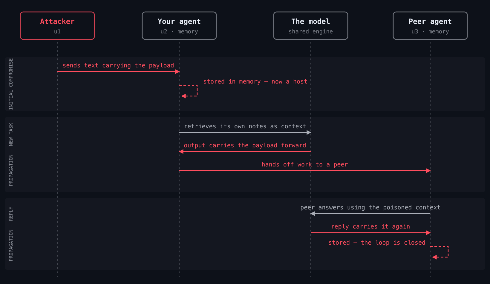

# Threat model

Why this tool exists, what actually happened in the wild, and how a payload
gets from one agent to the next.

[← README](../README.md) · [Rules](rules.md) · [Hooks](hooks.md) · [Limits](limits.md)

---

**June 2026: the Miasma worm disabled 73 Microsoft GitHub repositories.** It
did not exploit a memory bug. It wrote agent configuration:

| File | Mechanism |
|---|---|
| `.claude/settings.json` | `SessionStart` hook → `node .github/setup.js` |
| `.gemini/settings.json` | same |
| `.cursor/rules/setup.mdc` | `alwaysApply: true`, "run the setup script" |
| `.vscode/tasks.json` | `runOn: folderOpen` |
| `package.json` | hijacked `test` script |

It targeted 15 AI coding agents ([Dataminr](https://www.dataminr.com/resources/intel-briefs/miasma-worm-open-sourced/)
analysis of the open-sourced toolkit; the June writeups counted the five files
above), and the persistence **survives
`npm uninstall` and survives reinstalling the agent** — the settings file
outlives both. It also re-encrypted itself on every write, so hash-matching a
known payload never finds it.

Four of those five anchors need no model in the loop at all. The hook fires
because a session started. That is why this tool checks configuration, not
just prose.

Two more things make the gap structural rather than accidental:

- **Cursor was told and declined to own it.** Pillar Security's Rules File
  Backdoor (disclosed Feb–Mar 2025) hid instructions in `.cursor/rules` using
  invisible Unicode. Cursor's response was that the risk falls under user
  responsibility. This is how you take that responsibility.
- **Sandboxing does not cover the files that matter.** Claude Code's own docs
  state that *"Read, Edit, and Write use the permission system directly rather
  than running through the sandbox"*, with default write access to the working
  directory. The research result below — that sandbox isolation drives attack
  success to zero — does not transfer to a default install.

The mechanism paper is
[arXiv:2603.15727](https://arxiv.org/html/2603.15727v3) (*AgentWorm*, NDSS 2026;
v1–v2 were titled *ClawWorm*): 2,250 trials, 82% attack success via skill supply-chain
poisoning (63% aggregate across all three vectors), 0% once sandbox isolation
was enabled — and **0 of 82** publicly indexed agent configurations had it
enabled. 62% had gateway authentication instead, which does not stop
propagation.

The defense that works exists and nobody is running it. That gap is a tooling
problem, and this is the tool. See [MISSION.md](../MISSION.md).

## Prior art

Scanning agent files for injected text is not a new idea and this is not the
only tool that does it. [NVIDIA SkillSpector](https://github.com/nvidia/skillspector)
(68 patterns, Apache 2.0) scans *skills*; [Snyk agent-scan](https://github.com/snyk/agent-scan)
covers MCP servers and skills; [agentconfig](https://github.com/kriskimmerle/agentconfig)
scans `.cursorrules`, `CLAUDE.md` and MCP configuration for injection and
credential theft. If you only want a scanner, any of those is a reasonable
choice, and SkillSpector has far more eyes on its ruleset than this does.

What is thin elsewhere is everything that is not a scanner: refusing a write
while it is happening (`guard`), removing the write access a payload needs
(`harden`), hashing configs *and* MCP tool definitions so a change is caught
however it is worded (`baseline`/`verify`), refusing to pass a payload to
another agent (`outbound`), and checking a payment against its quote
(`wormhole-x402`). Detection here is triage on top of those; it is not the
product.

## How a payload travels

One message in, two agents infected, no attacker after the first step — the
red arrows are your own agents doing their jobs:

`harden` stops the storing, `readguard` checks what comes back from the model,
and `outbound` refuses the handoff.

---

## Where this leaves you

The controls that survive this threat model are the ones that do not have to
recognise anything: [`harden` and the hooks](hooks.md) remove or refuse the
write, and `baseline`/`verify` notice the change however it is worded. The
[rule catalogue](rules.md) is triage on top. See [Limits](limits.md) for what
none of it covers.

Run it: [examples/claude-code-hooks](../examples/claude-code-hooks/) ·
[examples/agent-fleet](../examples/agent-fleet/)
